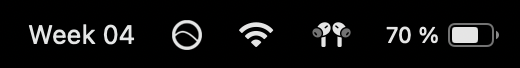
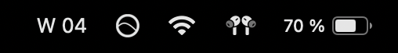
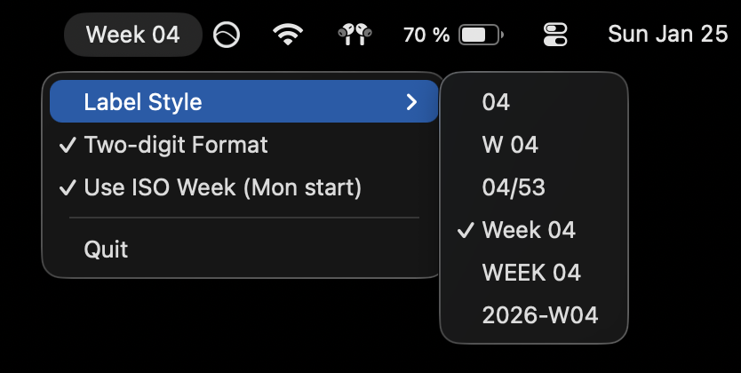

# WeekNumber
A minimal macOS app that displays the current week number in your menu bar.

## Download
[Latest WeekNumber release here 📅](https://github.com/BaldrianSector/week-number/releases/download/v1.0.0/WeekNumber.dmg)

## Install
1. Open the DMG.
2. Drag `WeekNumber.app` → `Applications`.
3. If macOS blocks it, go to **System Settings** → **Privacy & Security**, scroll to the WeekNumber warning, and click **Open Anyway**. Click **Open Anyway** again in the confirmation dialog and you should be good to go.

## Add to Login Items
1. Open **System Settings** → **General** → **Login Items**.
2. Under **Open at Login**, click **+**.
3. Select `WeekNumber.app` (in your Applications folder) and click **Add**.

## Screenshot

## Settings
- **Label Style**: Choose how the week appears in the menu bar.

- **Two-digit Format**: Pads single-digit weeks with a leading zero (e.g., `04`).
- **Use ISO Week (Mon start)**: Uses ISO-8601 week rules (weeks start Monday and week-year can differ near New Year).
